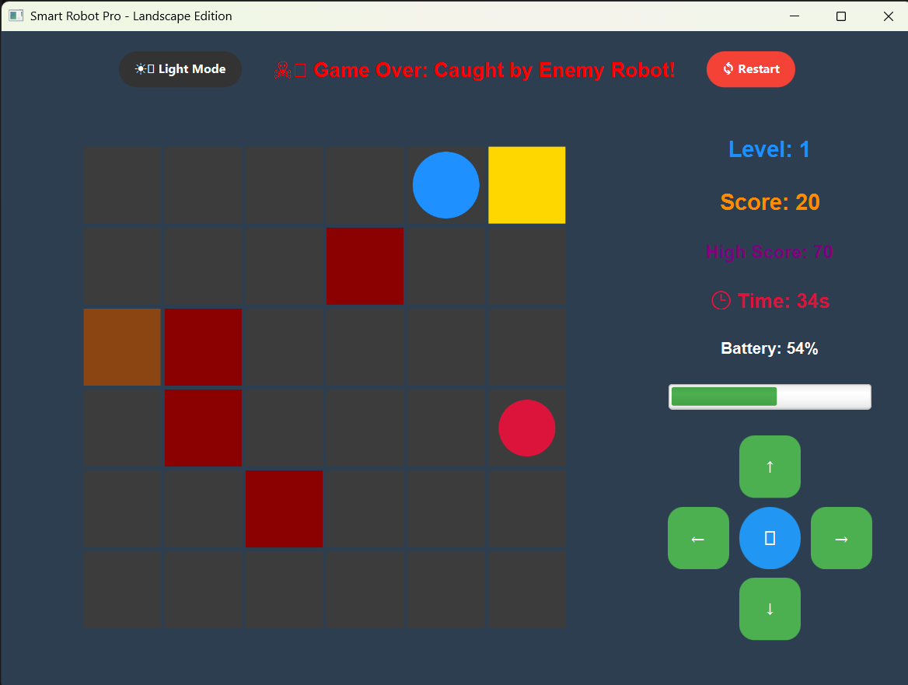

# 🤖 Smart Robot Simulation - Advanced Edition

A JavaFX-based 2D grid simulation game built to demonstrate core Object-Oriented Programming (OOP) principles, graphical user interface design, and intelligent AI pathfinding algorithms.

![Game Screenshot]


## 🎮 Features

*   **Dual Control System:** Drive the cleaning robot manually using **Keyboard Controls** (`W`, `A`, `S`, `D` or `Arrow Keys`) or use the mouse for **Autonomous Pathfinding** (Click-to-drive).
*   **🧠 Smart AI Enemy:** The enemy robot utilizes the **Breadth-First Search (BFS)** algorithm to actively scan the grid, navigate around solid walls, and dynamically hunt the player down.
*   **🚨 Dynamic Obstacles:** Dodge moving red Patrol Bots that slide continuously across the map, alongside static walls that increase in number as the player levels up.
*   **⚡ Resource Management:** Every movement drains the robot's battery. Players must locate charging stations while balancing time limits and scores.
*   **🎁 Power-Ups & Bonuses:** Grab cyan shields for 10 seconds of invincibility and battery preservation, and race against the clock to grab limited-time "Golden Dirt" for massive bonus points.
*   **🌙 Modern UI:** A clean, responsive interface featuring a real-time status board, progress bars, interactive D-Pad, and a dynamic **Dark Mode** toggle.
*   **💾 Data Persistence:** Uses Java File I/O to save and load the highest score across different gaming sessions.

## 🛠️ Tech Stack & Architecture

*   **Language:** Java (JDK 11+)
*   **GUI Framework:** JavaFX
*   **Core Concepts:**
    *   Strict OOP Architecture (Encapsulation, Abstraction, Inheritance, Polymorphism)
    *   Data Structures (Queues, ArrayLists)
    *   Algorithms (Breadth-First Search for AI Pathfinding)
    *   Event Handling & JavaFX `Timeline` Game Loops

## 📚 Project Documentation & Report

**Want to understand how this project actually works under the hood?**

The complete project report (`Smart_Robot_Simulation_Report.pdf`) is included in this repository. To fully grasp the core logic, system architecture, and software engineering principles behind this simulation, **reading this report is highly recommended.**

### What's inside the report?
*   Detailed UML Class Diagrams explaining the structural hierarchy.
*   Step-by-step breakdowns of the BFS AI pathfinding logic and boundary condition mapping.
*   Mapping of the project to Complex Engineering Problem solving standards and Course Outcomes.

📥 **[Read the Full Project Report Here][Smart Robot Simulation Project Report  .pdf](../Smart%20Robot%20Simulation%20Project%20Report%20%20.pdf)(Smart_Robot_Simulation_Report.docx)**

## 🚀 How to Run the Project

1. Clone this repository to your local machine:
   ```bash
   git clone [(https://github.com/NawyazHridoy/smart-robot-simulation-java)
